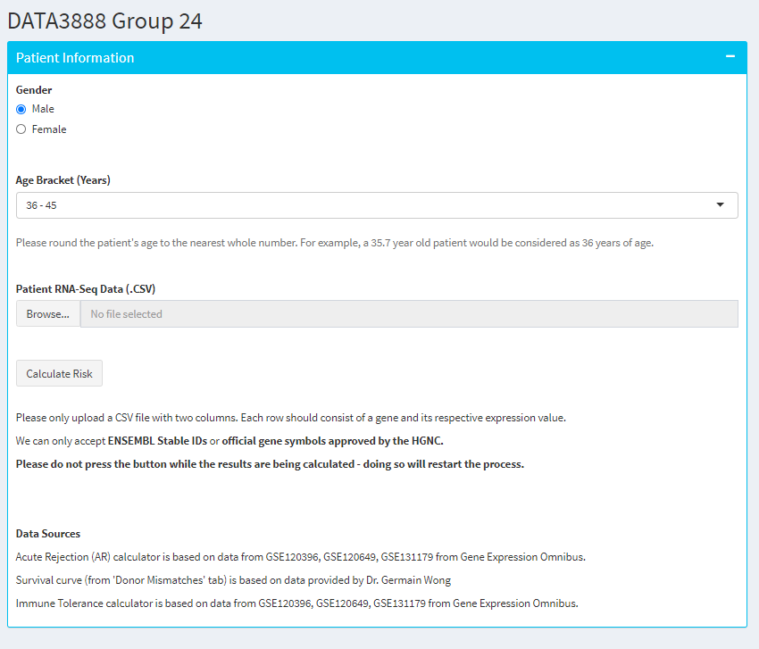

```{r, echo=FALSE}
library(knitr)
opts_chunk$set(tidy.opts=list(width.cutoff=20),tidy=TRUE)
```

```{r load_packages, include=TRUE, echo=FALSE,message=FALSE, warning=FALSE}
library(tidyverse)
library(knitr)
library(janitor)
library("readxl")
library(ggfortify)
library(GGally)
library(qtlcharts)
library(leaps)
library(sjPlot)
library(partykit)
library(rpart)
library(caret)
library(pinp)
library(tinytex)
library(GEOquery)
library(R.utils)
library(reshape2)
library(ggplot2)
library(limma)
library(biomaRt)
library(ggbiplot)
library(factoextra)
library(caret)
library(glmnet)
library(DESeq2)
library(edgeR)
library(DEFormats)
library(ROCR)
library(pROC)
library(doParallel)
library(foreach)
library(DescTools)
library(ggthemes)
library(class)
library(rsconnect)
library(BiocManager)
library(affy)
library(oligo)
# library(pd.mogene.2.0.st)
# library(mogene20sttranscriptcluster.db)
library(stringr)
# library(dashboardthemes)
library(survminer)
library(survival)
library(survMisc)
library(EnsDb.Hsapiens.v79)
library(tidyverse)
library(class)
library(cvTools)
library(ggplot2)
library(e1071)
library(pheatmap)
library(caret)
library(survival)
library(survminer)
library(Hmisc)
library(randomForestSRC)
library(glmnet)
library(dummies)
```

## Aim and Background

### Motivation

End-stage renal disease (ESRD) is the final stage of chronic kidney disease and poses a major threat to the body as the excretory system fails to function properly. To combat kidney failure, patients can choose two forms of treatment in terms of medical intervention: renal dialysis or organ transplantation. Renal dialysis imitates kidney functionalities by maintaining blood pressure and removing excess waste from the body. However, forms of renal dialysis (e.g. haemodialysis) can be discomforting and place mobile restrictions on the patient as they are physically connected to a hemodialyzer.

Alternatively, kidney transplantation is a lifesaving treatment that is greatly preferred over renal dialysis since it poses less restrictions on diet and lifestyle whilst lessening long-term health problems. However, kidney organ allocation has posed itself as a major resource allocation problem due to a disproportionately high number of patients to kidney donors. This shortage in donor kidneys results in the need for a careful assessment in allocating organs to patients that potentiate in maximal survivability


### Aim of the Project

With this problem in mind, we developed a risk calculator tool to aid in the effective and efficient allocation of donor organs to potential patients, assisting practitioners in their decision making for kidney allocation, as well as providing insight into immunosuppressive drug prescriptions. 

The risk calculator was developed with the intention that it would be used in a clinical setting where patient-nephrologist shared decision making is implemented. According to Gordon (2013), shared decision making promotes patient-centred care - it permits the nephrologist’s expertise to be integrated with the patient’s personal values and beliefs concerning future treatment. Within this clinical setting, we hope that our calculator provides an opportunity for discussion that concerns the nature of treatment across the transplantation process.


### Multidisciplinary Context

The risk calculator draws from three related areas of organ transplantation and donor-patient matching. 

The first portion of the calculator utilises the patient’s genetic expression from RNA- Seq to predict the probability that they experience T-cell or antibody mediated acute rejection (AR). Here, we define acute rejection as a sudden decline in renal graft function before 3 months post-transplantation. This portion of the calculator can aid practitioners in deciding the degree of immunosuppressive medication needed initially for the patient.

The second portion of the risk calculator estimates the time until *de novo* donor specific antibodies (DSA) arise for the patient’s phenotype (e.g. age and gender), based on the potential number of Class II eplet mismatches between recipient and the donor kidney. DSA presence has been found to be associated with many forms of rejection and graft failure. Hence, this portion of the calculator aims to estimate graft survivability of different age and gender subpopulations (Dayoub 2018) based upon the potential number of mismatches between patients and future donors. 

While immunosuppressive drugs like tacrolimus and mycophenolate mofetil minimise adverse graft effects, they unfortunately create weakened immune systems. However, some rare patients are operationally ‘tolerant’ (OT) and can maintain stable graft function after drug removal. Hence, our final part will be predicting the patient’s reliance on immune suppression from their genetic data, which can further help with the practitioner’s prescription making.
Ultimately, with ~10% of Australian adults experiencing forms of chronic kidney disease in 2011-12 (AIHW), we hope that our product improves ESRD management for practitioners and allow better quality-of-life for patients.

## Data Collection

### Part 1. Estimating the Probability of AR

Our ‘Acute Rejection’ (AR) part is based on data taken from the Gene Expression Omnibus (GEO) series of GSE120396, GSE120649 and GSE131179. We merged the three datasets together in order to achieve a larger sample for model training and potentially have smaller margins of error. However, because of differences in the number of genes measured between datasets, as well as different expression scales (e.g. counts per million), or the use of Ensembl IDs rather than official gene symbols from the *HGNC*, we had to perform some pre-processing before they can be merged.

The GSE120396, GSE120649 and GSE131179 series contained 88, 16 and 34 files respectively, with each file describing the gene expression count for a patient that was either normal (non-AR), or suffered from AR.

To resolve the issue of different gene expression scales between datasets (e.g. some contained raw counts and others may have already been standardised), 'Counts per Million' (CPM) and log~2 transformation were performed on GSE120649 and GSE131179 to match the already standardised GSE120396. The Ensembl ID in GSE120649 and GSE131179 were also converted to official gene symbols using the `EnsDb.Hsapiens.v79` library.

Following this, the datasets were then joined based on common gene symbols. However, simply merging the datasets produced the following boxplot of gene expression values from patients across the three studies.

```{r, echo = FALSE, out.width = "200px"}

```

It can be demonstrated from the boxplots above that GSE120649 and GSE131179 had a lower expression level than GSE120396. A possible method to account for this is to perform quantile normalisation on the merged data.


Quantile normalization is one of the most widely adopted pre-processing methods for analysing RNA-Seq data - it reduces batch effect and technological noise by scaling the variables to have values between 0 and 1, ensuring that the distribution of gene expressions from each dataset are the same. This potentially allows for more robust predictions that can be generalised to different sequencing platforms (Qiu et al., 2013).

```{r, echo = FALSE, out.width = "200px"}

```

As seen above from the boxplot above, performing quantile normalisation had a substantial effect on gene expression distribution - the data from all three merged studies appear normalised with similar medians around 10.


### Part 2. Estimating Time to *de novo* DSA Presence

The eplet mismatch dataset was provided by Dr. Germaine Wong from the University of Sydney. Based on previous research studies conducted, it was found that there was no significant correlation between BMI category and graft survival (Papalia et al., 2010). Thus, we focused only on using age and gender as phenotypic information when stratifying the data.

Each transplant recipient from the dataset was categorised into a certain age group (i.e. ‘25-35’,’36-45’, and ‘46-55’), and whether they had less-than or greater-than-or-equal-to 30 Class II eplet mismatches (30 was approximately the median number of Class II eplet mismatches).

```{r, eval=FALSE, message=FALSE, warning=FALSE}

survdt_m<- survdt_m %>% mutate(agetxn=case_when(
  agetxn >= 25 & agetxn <= 35 ~ '25 - 35',
  agetxn >= 36 & agetxn <= 45 ~ '36 - 45',
  agetxn >= 46 & agetxn <= 55 ~ '46 - 55'
))

survdt_m <- survdt_m %>%  mutate(MM = case_when(
  MM <= 30 ~ "<= 30 MM",
  MM > 30 ~ "> 30 MM",
))
```

From this, a Survival object was created based on these age/gender subpopulations stratified by their number of Class II mismatches (< 30 or >= 30), with the event as the presence of DSA and the time taken for the event to occur.

```{r, eval=FALSE, message=FALSE, warning=FALSE}
#E.g. Selecting a male aged 46 - 55 years
user_survdt = survdt_m %>% dplyr::filter(
  Gender == "Male",
  Age == "46 - 55"
)
```

The visualisation of the survival curve for the subpopulation was represented through a Kaplan-Meier curve.


### Part 3. Predicting Operational Tolerance

To predict operational tolerance, we collected the GSE22229 dataset which contained raw CEL files pertaining to the gene expression for patients that were either tolerant or not.

CEL files are created by the Affymetrix DNA microarray image analysis software, and contain estimated probe (sequence of DNA base pairs) intensity values extracted from Affymetrix Genechips. Each probe was mapped to a specific gene symbol using the GPL570 Chip Description File (CDF).

Since the data is in the newer Affymetrix Arrays format (Gene ST arrays), we utilised the `oligo` library to read a list of CEL files.  This list was then converted from an AffyBatch object into an ExpressionSet (i.e. gene expression) using the `rma` function from the `pd.mogene.2.0.st` library. The `rma` function, short for *Robust Multichip Average*, also simultaneously log~2 transforms and normalises the gene expressions. 

```{r tac_processing, eval=FALSE, message=FALSE, warning=FALSE}
setwd("data/GSE22229_RAW/")
celFiles <- list.celfiles()
affyRaw <- read.celfiles(celFiles)
eset <- rma(affyRaw)

setwd("../../")
write.exprs(eset,file="tolerance.txt")
my_frame <- data.frame(exprs(eset))
write.table(my_frame,
            file="tolerance.txt",
            sep="\t")
```

After converting our ExpressionSet object into a dataframe, we then investigated the gene expression distribution amongst patients using a boxplot to ensure that the data has been normalised and can be used for further processing.

```{r, echo = FALSE, out.width = "200px"}

```

The boxplot above demonstrates strong similarity in gene expression between patients and so our dataframe can be further analysed without concern of batch effects between sample measurements. 

After quantile normalization and batch effect removal, we performed feature selection. Firstly, genes that were lowly expressed in both groups were removed by using the `filterByExpr()` function from the `edgeR` package; these genes do not provide much biological meaning and removing them allows for less statistical tests to be performed, as well as allowing greater reliability in observing the variance between different groups (Law et al., 2018)

We then selected the most differentially expressed genes between the two groups using multiple *t*-tests from the `limma` package. Finally, a review by Massart et al. (2017) suggested a collection of genes that were highly differential between tolerant and normal patients, and so these were also added to our final training dataset (if they weren’t already filtered for previously).


## Evaluation Strategies

We decided to implement penalised logistic regression methods when creating separate predictive models for Part 1 and Part 3 of our risk calculator. Logistic regression was utilised as it provides a probabilistic output for a specific risk, which may be more informative than a binary outcome. Furthermore, the penalised nature of some methods (e.g. Ridge, LASSO, Elastic Net) can address the overfitting or multicollinearity issue prevalent in large *p*, small *n* situations in gene expression data.

The models for Part 1 and Part 3 were trained using their respective pre-processed data onto a 50-repeated 5-fold cross validation (CV) procedure. The performance of our models in predicting the CV test-set under Ridge, LASSO and Elastic Net methods were evaluated using three primary metrics: accuracy, AUC and the Brier Score.

In the case of class imbalance within the training dataset, the accuracy metric may suggest an inflated performance. As such, the AUC and Brier Score were also calculated.

•	The AUC is a more robust metric with less bias to class size. Briefly, it can be thought of as the probability that a true-positive sample (e.g. AR patient) has a greater predicted risk than a true-negative sample (e.g. normal patient).

•	The Brier Score meanwhile complements the AUC by checking that the predicted risk of a sample is actually similar to the true value. For example, in a true-positive case (i.e. label = 1) with a predicted risk of 0.8, the Brier Score quantitatively measure how close the 0.8 value is to 1. Better predictions are reflected as a lower Brier Score.

To select our final models for Part 1 and Part 3 respectively, we evaluated the accuracy, AUC, and Brier Score from different penalised models (Ridge, LASSO, and Elastic Net) using boxplot visualisations.

For Part 2, since we are not predicting the probability of graft failure over time, there was no need to build and train a model.


## Model Selection

To select the optimal number of features (i.e. genes) for our model, the CV accuracy using the top 5 up to the top 120 most significant genes were calculated respectively. 

For Part 1, high LASSO accuracy was seen around *n* = 12 with 79%. However, this may not be robust when applied to real world data. In particular, it is unlikely that AR is caused only by the 12 genes, and it is also unlikely that incoming patient data will have these 12 significant genes. 

```{r, echo = FALSE, out.width = "250px"}
knitr::include_graphics("images/part1features.png")
```

Combined with the fact that penalised regression models can elicit further variable reduction, the choice of using 12 genes as predictors in our model may not be statistically wise. Hence, we decided to instead incorporate the top 100 most significant genes into our model for Part 1, which had a CV accuracy of 77%. Indeed, while this is marginally smaller than the CV accuracy for the top 12 genes, the use of top 100 genes may be more robust to independent data. As such, we also selected the top 100 most differentially expressed genes between OT and non-OT patients as our features for the Part 3 model.

When evaluating the CV accuracy, AUC, and Brier Score of Ridge, LASSO, and Elastic net, it was found that for both Part 1 and Part 3 data, Elastic Net mostly produced the best performance based on the three metrics. Below are the CV results from Elastic Net for both Part 1 and Part 3 (see Appendix for Ridge and LASSO results).

```{r, echo = FALSE, out.width = "200px"}

```


```{r, echo = FALSE, out.width = "200px"}

```

Therefore, our final model for Part 1 and Part 3 separately is an Elastic Net logistic regression model with 100 features that can address both internal and external validity.


### Deployment Process

Our risk calculator was deployed as an interactive Shiny application with a simple UI for patient input. An ‘Information' tab (Appendix) was also present that explains our mission, as well as providing theoretical information about AR and OT such that patients may be more medically informed and possibly be encouraged to demonstrate adherence and understanding to prescriptions.

To predict the risk of acute rejection and the likelihood of the patient relying on immunosuppression, the two trained Elastic Net models from Part 1 and Part 3 respectively will be applied to incoming gene expression data from the patient. Our Shiny application allows the user to input a *.csv* or *.txt* file containing raw gene counts (Appendix), which will be transformed with CPM and log~2 functions. If the input file contains Ensembl ID, our application will automatically convert it to official gene symbols. 

The inbuilt pre-processing function ensures that the app is efficient and easy to use for practitioners, who may not be confident to transform and process gene expression data. If all 100 genes used for the model are present in the input data, the trained model will be used.

However, if the input data only includes a portion of the 100 filtered genes, an alternative Elastic Net model will be trained on the spot as mentioned in our *Evaluation Strategies* section, but only on these portions of genes as the features in the original dataset. As the prediction from the alternative model can be different depending on the training-test split, we use the mean of 30 repeats to increase reliability.
 
The output of the risk calculator includes two colour-coded gauge plots, showing the predicted risk for the individual, and the population risk. This ensures that the information is easy to understand and can be easily understood by the patient to promote shared decision making. Below is an example output for AR prediction after patient data has been supplied. For results in predicting immunosuppression reliance, please see the Appendix.

```{r, echo = FALSE, out.width = "200px"}

```

The population risk for AR were based on the findings by Menon et al. (2017), and the percentage of the population not having OT (and thus requiring sustained immunosuppression) were based on the review by Newell et al. (2018)

For Part 2, a Kaplan-Meier curve was used to visualize the predictive outcome (time to DSA presence) for a subset of a population, which in our case was based on age and sex stratified by the potential number of eplet mismatches the recipient may have with the donor.

```{r, echo = FALSE, out.width = "200px"}

```

This may assist in better kidney allocation and prescriptions based on historical performance of other recipients who belong to the same subgroup.
 
\newpage
## Discussion and Conclusion

### Potential shortcomings

#### Shortcomings with Part 1 (Predicting AR)

The main shortcoming of the risk calculator is the long computational time involved when the patient's input data is in the form of Ensembl ID as it has to be converted to official gene symbols. Furthermore, if the patient does not contain all 100 genes used to train the original model, then the alternative model (as mentioned previously) must be made on-demand, with computational times that can be rather long (~ 1 minute).

Furthermore, as demonstrated in the boxplot showing quantile-normalized counts, the median of normalised gene expression in the training data is around 10. This means that if the median of the input counts differs significantly from 10, the prediction is likely to be invalid. 


#### Shortcomings with Part 2 (Estimating DSA Presence)

The main shortcoming of this methodology is the use of a small dataset (198 entries after removing null entries). Thus, when we stratify the data based on subgroups of variables, we have limited information available for creating the Kaplan Meier curve. Hence, some subpopulations are inaccurately represented, with some curves being uninformative.

Another shortcoming is the inability to verify if some positive events (i.e. DSA presence) were due to censoring or not. As such, this may occasionally manifest as an overestimation in graft failure risk during some periods.

#### Shortcomings with Part 3 (Predicting Reliance on Immunosuppression)

Similar to Part 1, limitations are primarily attributed to long computational times for the same reasons.

However, an additional shortcoming with Part 3 is the small number of OT patients (19) used to train the model. GSE2229 was one of the only datasets with normalised OT gene expression able to be calculated, and so the lack of data may diminish feasibility of predictions for patients with gene expressions recorded from different platforms.

### Future work and improvements

The study of epitope compatibility is still in its infant stages and hence, greater research needs to be taken in order to drive advancements in ESRD management (Tambur 2018). Furthermore, a procedural standard in experimental design is encouraged so that consistent results concerning survivability can be reliably reproduced. For example, several studies determining whether BMI is a significant variable for graft rejection have demonstrated contradictory results, possibly due to different experimental designs (Papalia et.al, 2010). 

There is also a need for larger and more diverse datasets so that various population confounders and other sources for variation can be accounted for. For example, the eplet data consisted mostly of Caucasoid patients, which could have affected graft outcome.

Finally, further study into operational tolerance (OT) may improve the validity of future predictions as there are currently limited samples of OT patients globally. Indeed, OT diagnosis is difficult due to the ethical issues of temporarily ceasing immunosuppressive therapy.


### Conclusion

In conclusion, we believe the risk calculator will aid in the effective and accurate allocation of kidney donor organs to those needing the lifesaving treatment of transplantation. In particular, by predicting a patient’s graft outcome in terms of AR, OT, and estimated time until DSA appear (in relation to the sub-population corresponding to their phenotype), we hope that we can assist practitioners in their decision-making and make more informed choices in immunosuppressive prescriptions. 

\newpage

## Contribution Statement

### Andrew Auwyang

Andrew was responsible for designing both the initial ‘Project Plan’ presentation as well as parts of the final presentation. In terms of data analysis, Andrew worked collaboratively with Alex on the ‘Operational Tolerance’ component of the product – after Alex worked on processing the raw CEL files and matching gene symbols using the CDF, Andrew then initiated model selection, proposing to use penalised logistic regression methods to account for the large p small n situation. Furthermore, he also suggested the use of the Brier Score as metric to evaluate models for both Part 1 and Part 3 as a way to validate the results from the AUC. In terms of the Shiny application and report, Andrew was primarily responsible for designing the Shiny application interface (e.g. input and output presentation). After suggestions from Alex in using the ‘pinp is not PNAS’ format for the report, Andrew edited the design of the final report. For both the report and the presentation, Andrew talked about the data processing and model selection for Part 3, as well as discussing the objectives of the group’s product during the final presentation.

### Niruth Bogahawatta

For the DATA38888 project, Niruth contributed by building the second component of the Shiny app. This included working with the eplet data to plot a Kaplan-Meier curves which displayed the survival probability of a graft over time based on phenotypic data of the recipient and the potential number of mismatches. For the Shiny application, Niruth assisted in debugging and also worked on creating the ‘Information’ tab that describes the context of the product. His role during the presentation was explaining the methodology and steps which were used for Part 2 of the app, which was also followed in the final report for the project.

### Johanna Jones

Johanna contributed by organising the weekly meeting minute notes and organised the weekly progress slides for whenever the group met up on Mondays of each week. While Andrew, Eva and Niruth were building the three components of the product (i.e. the gene expression , eplet mismatches and immune suppression), Johanna conducted research on the effects of BMI, race, donor and recipient sex on the kidney allograft survival concerning. Johanna also did research concerning the survival statistics and the Kaplan-Meier curve. She found journal articles that supported the group’s findings and the researched statistical methods to analyse gene expression data. For the Shiny app, Johanna wrote the ‘Information’ tab which describes context of the app and how each component related to the shared decision-making target audience. Johanna’s role during the final presentation was to elicit the target audience, motivation, and the background for the project. Her contribution to the final report was that by writing the main aims and background, recommendations for future work and conclusion section.

### Eva Pu

Eva was responsible for making a risk calculator that predicts the risk of acute rejection given input of gene expression data (i.e. Part 1). After the three GSE datasets were joined, she performed appropriate transformations (e.g. log~2) and normalisations. She performed DEG analysis and feature selection, as well as comparing the performance of different machine learning models such as SVM and logistic regression. Eva was also responsible for completing the code for the technical deployment of the model in the Shiny app. This part of the app includes reading in raw files and performing the necessary pre-processing steps (e.g. converting Ensembl ID to official gene symbols if needed). Furthermore, she created the code needed to create alternative models on the spot if the input data is not suitable for the trained model (e.g. genes from input patient data does not match filtered genes used in the trained model). Eva also organised a meeting with Jean to gain feedback about our product, and passed this information to the group. She contributed to the presentation and reproducible report by providing by discussing the methods involved in the creation of Part 1 of the group’s product.

### Alex Wong

In the early weeks of the project, there was a need to merge the three gene expression datasets, GSE120396, GSE120649 and GSE131179, into one larger dataset. During this time, Alex performed some pre-processing on the given datasets and with the assistance of online guides, he was first able to convert the Ensembl IDs to official gene symbols for the GSE120649 and GSE131179 datasets. Following this, he performed left joins using common gene symbols to merge the datasets together. Alex was also responsible for proposing the idea of using immunosuppression reliance as another factor in describing predictive kidney allograft functioning. After finding a suitable dataset containing the gene expression for operationally tolerant and normal patients, Alex then processed the CEL file into a gene expression matrix using Bioconductor libraries. Some other contributions include basic formatting of the shiny app, proposing the reproducible report layout and structure, and researching the use of penalized regression models in our final model.


## Reference List

Australian Institute of Health and Welfare. (2019) Chronic Kidney Disease. Retrieved from https://www.aihw.gov.au/reports-data/health-conditions-disability-deaths/chronic-kidney-disease/overview

Dayoub, J. C., Cortese, F., Anzic, A., Grum, T., & de Magalhaes, J. P. (2018). The effects of donor age on organ transplants: A review and implications for aging research. Experimental gerontology, 110, 230-240.

Edgar R., Domrachev M., Lash AE. (2002). Gene Expression Omnibus: NCBI gene expression and hybridization array data repository. Nucleic Acids Res, 30(1),207-10.

Gordon, E. J., Butt, Z., Jensen, S. E., Lok‐Ming Lehr, A., Franklin, J., Becker, Y., ... & Penrod, D. (2013). Opportunities for shared decision making in kidney transplantation. American Journal of Transplantation, 13(5), 1149-1158.

David, G., & Kleinbaum, K. (2016). Survival analysis: a self-learning text. Springer-Verlag New York.

Law, C. W., Alhamdoosh, M., Su, S., Dong, X., Tian, L., Smyth, G. K., & Ritchie, M. E. (2016). RNA-seq analysis is easy as 1-2-3 with limma, Glimma and edgeR. F1000Research, 5.

Massart, A., Ghisdal, L., Abramowicz, M., & Abramowicz, D. (2017). Operational tolerance in kidney transplantation and associated biomarkers. Clinical & Experimental Immunology, 189(2), 138-157.

Menon, M. C., Cravedi, P., & El Salem, F. (2017). Acute Cellular Rejection. In Kidney Transplantation, Bioengineering and Regeneration (pp. 461-474). Academic Press.

Newell, K. A., Adams, A. B., & Turka, L. A. (2018). Biomarkers of operational tolerance following kidney transplantation–The immune tolerance network studies of spontaneously tolerant kidney transplant recipients. Human immunology, 79(5), 380-387.

Papalia, T., Greco, R., Lofaro, D., Maestripieri, S., Mancuso, D., & Bonofiglio, R. (2010). Impact of body mass index on graft loss in normal and overweight patients: retrospective analysis of 206 renal transplants. Clinical transplantation, 24(6), E241–E246.

Tambur, A. R. (2018). HLA-epitope matching or eplet risk stratification: the devil is in the details. Frontiers in immunology, 9, 2010.

Qiu, X., Wu, H. & Hu, R. The impact of quantile and rank normalization procedures on the testing power of gene differential expression analysis. BMC Bioinformatics 14, 124 (2013).

\newpage
\newpage

## Appendix

### Appendix 1. Ridge and LASSO results for Part 1

```{r, echo = FALSE, out.width = "220px"}

```

```{r, echo = FALSE, out.width = "220px"}

```


### Appendix 2. Ridge and LASSO results for Part 3

```{r, echo = FALSE, out.width = "220px"}

```

```{r, echo = FALSE, out.width = "220px"}

```

### Appendix 3. Gauge Plot result in Predicting Immunosuppresion Reliance

```{r, echo = FALSE, out.width = "220px"}

```

\newpage

### Appendix 4. Patient Input from Shiny Application

```{r, echo = FALSE, out.width = "250px"}

```

### Appendix 5. Information Tab from Shiny Application

```{r, echo = FALSE, out.width = "250px"}

```


